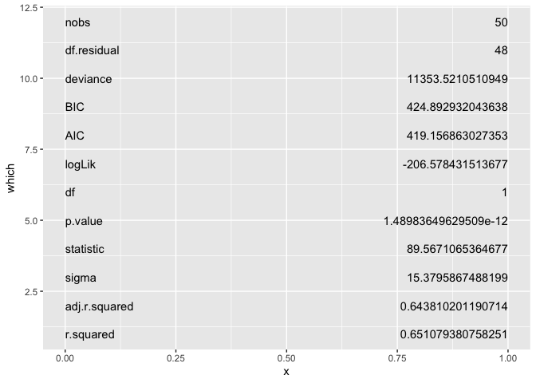
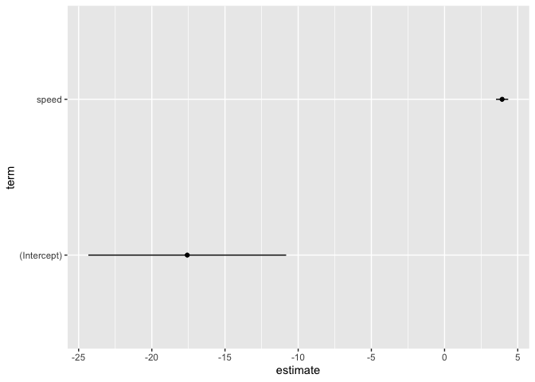
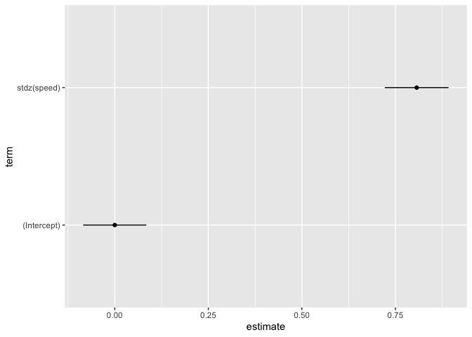
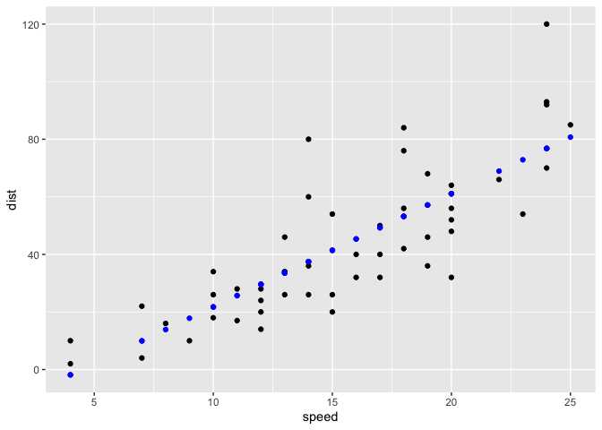

  - [{vizbroom}](#vizbroom)
      - [Installation](#installation)
      - [User interface idea…](#user-interface-idea)
  - [How we built this functionality](#how-we-built-this-functionality)
      - [Step 0. Build vis with base ggplot2 and
        broom](#step-0-build-vis-with-base-ggplot2-and-broom)
  - [Write functions w/ ‘recipe’ substeps: 1. compute\_?; 2. define
    ggproto; 3. write geom\_\*; 4.
    test.](#write-functions-w-recipe-substeps-1-compute_-2-define-ggproto-3-write-geom_-4-test)
      - [Write `geom_county()` (polygon)](#write-geom_county-polygon)
      - [try it out..](#try-it-out)

<!-- README.md is generated from README.Rmd. Please edit that file -->

# {vizbroom}

## Installation

You can install the development version of vizbroom from
[GitHub](https://github.com/) with:

``` r
# install.packages("devtools")
devtools::install_github("EvaMaeRey/vizbroom")
```

## User interface idea…

``` r
library(ggplot2) 
library(ggbroom)

visbroom(data = ?, formula = ?, method = ?) + 
  viz_glance()

visbroom(data = ?, formula = ?, method = ?) + 
  viz_tidy()

visbroom(data = ?, formula = ?, method = ?) + 
  viz_tidy_stdz()

visbroom(data = ?, formula = ?, method = ? ) + 
  viz_augment()

visbroom(data = ?, formula = ?, method = ? ) + 
  viz_augment_stdz()
```

<!-- badges: start -->

<!-- badges: end -->

# How we built this functionality

## Step 0. Build vis with base ggplot2 and broom

``` r
library(broom)
# glance
# augment
# tidy
stdz <- function(x){
  
  (x - mean(x))/sd(x)
  
}

m <- lm(dist ~ speed, data = cars)


glance(m) 
#> # A tibble: 1 × 12
#>   r.squared adj.r.squared sigma statistic  p.value    df logLik   AIC   BIC
#>       <dbl>         <dbl> <dbl>     <dbl>    <dbl> <dbl>  <dbl> <dbl> <dbl>
#> 1     0.651         0.644  15.4      89.6 1.49e-12     1  -207.  419.  425.
#> # ℹ 3 more variables: deviance <dbl>, df.residual <int>, nobs <int>
tidy(m)
#> # A tibble: 2 × 5
#>   term        estimate std.error statistic  p.value
#>   <chr>          <dbl>     <dbl>     <dbl>    <dbl>
#> 1 (Intercept)   -17.6      6.76      -2.60 1.23e- 2
#> 2 speed           3.93     0.416      9.46 1.49e-12
augment(m) |> head()
#> # A tibble: 6 × 8
#>    dist speed .fitted .resid   .hat .sigma  .cooksd .std.resid
#>   <dbl> <dbl>   <dbl>  <dbl>  <dbl>  <dbl>    <dbl>      <dbl>
#> 1     2     4   -1.85   3.85 0.115    15.5 0.00459       0.266
#> 2    10     4   -1.85  11.8  0.115    15.4 0.0435        0.819
#> 3     4     7    9.95  -5.95 0.0715   15.5 0.00620      -0.401
#> 4    22     7    9.95  12.1  0.0715   15.4 0.0255        0.813
#> 5    16     8   13.9    2.12 0.0600   15.5 0.000645      0.142
#> 6    10     9   17.8   -7.81 0.0499   15.5 0.00713      -0.521


library(ggplot2)
library(magrittr)

glance(m) %>%  
  tidyr::pivot_longer(cols = 1:length(.)) %>% 
  dplyr::mutate(which = dplyr::row_number()) %>% 
ggplot(data = .) + 
  aes(x = 0, y = which) + 
  geom_text(aes(label = name), hjust = 0 ) + 
  geom_text(aes(label = value, x = 1), hjust = 1)
```



``` r

tidy(m) |>
  ggplot() + 
  aes(y = term, x = estimate) + 
  geom_point() + 
  geom_segment(aes(x = estimate + std.error,
                   xend = estimate - std.error,
                   yend = term))
```



``` r

lm(stdz(dist) ~ stdz(speed), data = cars) |>
 tidy() |>
  ggplot() + 
  aes(y = term, x = estimate) + 
  geom_point() + 
  geom_segment(aes(x = estimate + std.error,
                   xend = estimate - std.error,
                   yend = term))
```



``` r


ggplot(data = augment(m)) + 
  aes(x = speed, y = dist) + 
  geom_point() + 
  geom_point(aes(y = .fitted), color = "blue")
```



# Write functions w/ ‘recipe’ substeps: 1. compute\_?; 2. define ggproto; 3. write geom\_\*; 4. test.

## Write `geom_county()` (polygon)

``` r
################# Step 1. Compute panel function ###########

###### Step 2. Specify ggproto ###############

########### Step 3. geom function, inherits from sf ##################
```

## try it out..
